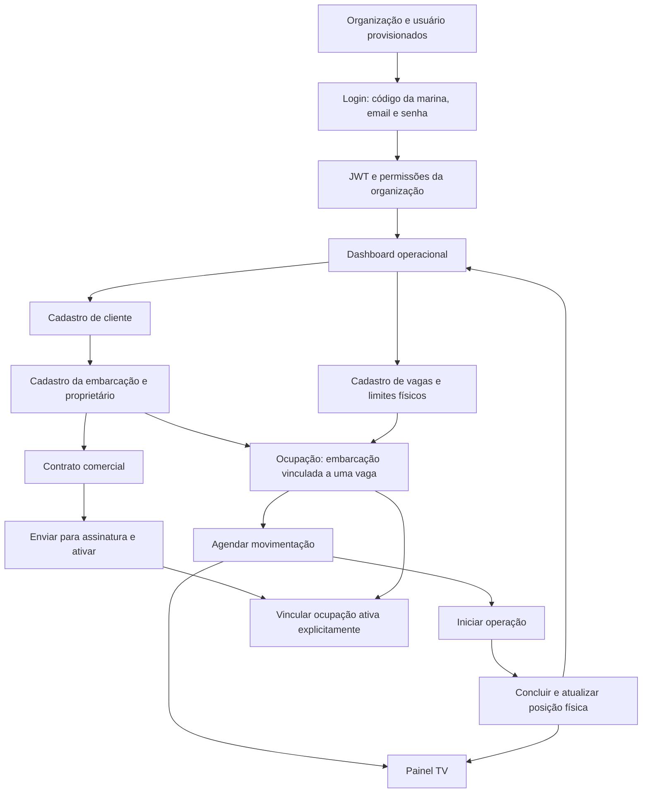
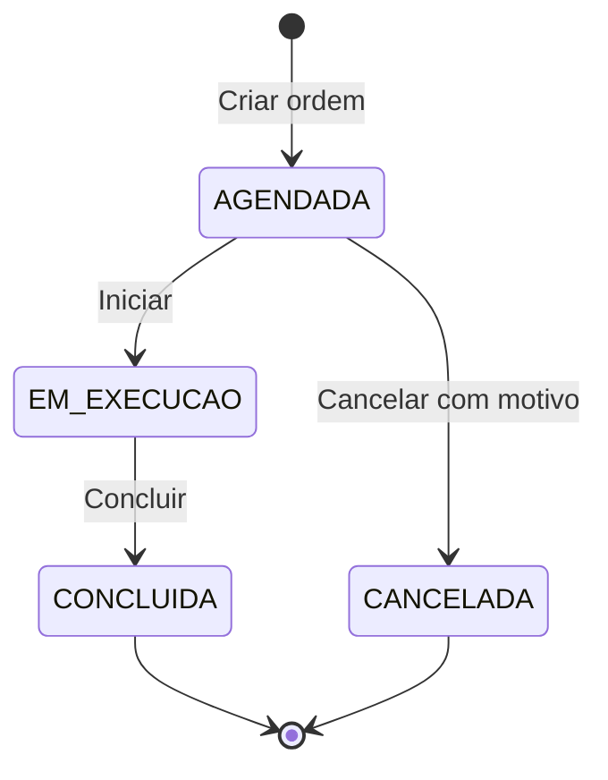
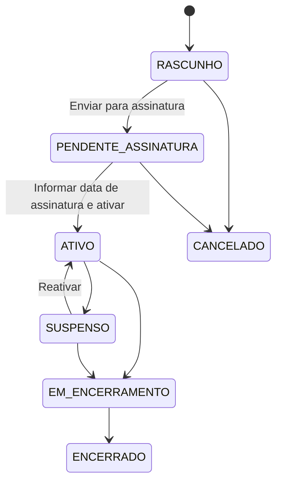
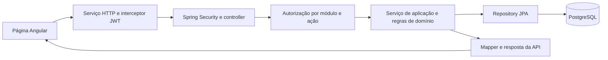

# Fluxo atual do Caisora

Levantamento em 08/10/2026, baseado na leitura das rotas Angular, controllers, serviços, entidades, migrations e testes existentes. A aplicação não foi executada e os testes não foram rodados neste levantamento; os comportamentos abaixo descrevem a implementação encontrada.

## Visão geral

O Caisora é um ERP SaaS para gestão de marinas. Cada organização representa uma marina, com usuários, clientes, embarcações, vagas e operações próprios. O núcleo implementado cobre os cadastros, a alocação de vagas, as ordens de movimentação e os contratos comerciais.

O diagrama mostra a sequência usual de uso. Contrato e ocupação têm ciclos independentes: a criação de uma ocupação ou movimentação não exige contrato ativo no código atual.

## 1. Entrada e autorização

1. A organização e o usuário precisam existir previamente. A API de organizações exige `ADMINISTRADOR_PLATAFORMA`; o repositório também contém um exemplo SQL de criação do administrador inicial em `deploy/criar-admin-inicial.sql.example`.
2. O usuário acessa `/login` e informa código da marina, email e senha.
3. `POST /api/v1/autenticacao/login` normaliza o código e o email, localiza o usuário dentro da organização, verifica a senha com BCrypt e verifica se usuário e organização estão ativos.
4. O backend retorna JWT, prazo de expiração e dados do usuário com módulos e permissões resolvidos.
5. O Angular salva a sessão em `localStorage`, anexa `Authorization: Bearer` às chamadas da API e protege as rotas.
6. O layout consulta `/api/v1/autenticacao/me` para atualizar o usuário e suas permissões. O menu é filtrado conforme essas permissões.
7. Expiração local ou resposta HTTP 401 encerra a sessão; o interceptor redireciona ao login com informação da rota de retorno.

O isolamento usa banco e schema compartilhados, com `organizacao_id`. Os serviços dos módulos obtêm a organização do usuário autenticado e consultam os registros dentro dela. O fluxo normal não depende de enviar a organização no corpo de cada chamada.

Além dos guards do Angular, os controllers aplicam autorização com `@PreAuthorize`. `ControleAcesso` consulta a variabilidade da organização para o perfil e a ação solicitada.

## 2. Cadastros que sustentam a operação

| Cadastro | Papel no fluxo | Regras observadas |
| --- | --- | --- |
| Cliente | Proprietário e parte comercial | CPF/CNPJ sem duplicidade dentro da organização; ativação/inativação |
| Embarcação | Unidade movimentada e contratada | Proprietário da mesma organização e ativo para o vínculo; validação de dados físicos e identificadores |
| Vaga | Local de alocação | Código sem duplicidade na organização; tipos `MOLHADA`, `SECA`, `POITA`, `OUTRA`; limites físicos e status ativo |
| Usuário | Solicitante, operador e administrador | Perfil, senha e status; API existente, sem rota de gestão de usuários no Angular atual |

As telas de clientes, embarcações e vagas oferecem listagem, criação e edição. Os controllers também expõem alteração de status.

## 3. Ocupação e posição física

**Ocupação** representa o vínculo ativo da embarcação com uma vaga. **Posição física** representa onde a embarcação se encontra durante a operação: `VAGA`, `AGUA`, `PIER_ESPERA`, `AREA_SERVICO`, `EXTERNA` ou `DESCONHECIDA`.

Ao criar uma ocupação, o backend verifica:

- embarcação e vaga da organização autenticada e ativas;
- ausência de outra ocupação ativa para a embarcação e para a vaga;
- compatibilidade de comprimento, boca, calado, altura e peso quando medida e limite estiverem preenchidos;
- datas coerentes: início sem data futura além da tolerância de um minuto e fim previsto posterior ao início.

O ciclo da ocupação é `ATIVA → ENCERRADA`. A edição altera fim previsto e observações. O encerramento registra a data e libera o vínculo ativo.

A posição é criada sob demanda ao consultar a posição de uma embarcação ou preparar uma movimentação. Quando ainda não existe, é inicializada na vaga da ocupação ativa; sem ocupação ativa, começa como `DESCONHECIDA`. Uma posição já existente é reutilizada.

**Exemplo:** uma embarcação sai da vaga A para a água. Sua posição passa a `AGUA`, mas a ocupação da vaga A continua ativa. Ao retornar, ela volta à vaga da sua ocupação.

## 4. Movimentações

A edição e o reagendamento exigem uma ordem agendada. O cancelamento também exige `AGENDADA`: uma ordem em execução não pode ser cancelada pelo fluxo atual.

| Tipo | Origem e destino permitidos | Efeito na conclusão |
| --- | --- | --- |
| `LANCAMENTO` | Vaga → água ou píer de espera | Atualiza posição; mantém ocupação |
| `RETIRADA` | Água ou píer → vaga da ocupação ativa | Atualiza posição; mantém ocupação |
| `RETORNO_PARA_VAGA` | Área de serviço ou externa → vaga da ocupação ativa | Atualiza posição; mantém ocupação |
| `TRANSFERENCIA` | Vaga → outra vaga | Encerra ocupação anterior, cria nova e atualiza posição |
| `DESLOCAMENTO_INTERNO` | Origem registrada → píer, área de serviço ou externa | Atualiza posição; mantém ocupação |

Na criação, o serviço captura a posição de origem, valida destino e compatibilidade, registra solicitante, operador opcional, prioridade, horário agendado e observações. Impede uma segunda ordem aberta para a mesma embarcação e uma segunda reserva do mesmo destino por outra ordem aberta. Lançamento e transferência exigem posição coerente com a ocupação ativa.

Ao iniciar, o usuário autenticado é registrado como operador. Ao concluir, o sistema verifica novamente a posição de origem e as regras do destino, aplica os efeitos e grava histórico. A posição física muda na conclusão.

A transferência encerra a ocupação original antes de inserir a nova, preservando o fim previsto se ainda estiver no futuro. Essas alterações ocorrem na mesma transação. O histórico registra criação, edição, reagendamento, início, conclusão e cancelamento.

## 5. Dashboard e painel TV

- `/dashboard` reúne ordens atrasadas, em execução, próximas operações, conclusões do dia e indicadores. Permite iniciar e concluir operações conforme as permissões. Consulta a API a cada 30 segundos.
- `/painel-tv` é uma rota autenticada fora do layout principal e exige `PAINEL_TV:VISUALIZAR`. Apresenta o acompanhamento operacional e consulta a API a cada 15 segundos.
- As consultas dos painéis utilizam o fuso operacional `America/Sao_Paulo` para delimitar o dia.

As atualizações usam consultas HTTP periódicas. Não há necessidade de uma integração externa para alimentar esses painéis: os dados vêm do módulo de movimentações.

## 6. Contratos

O contrato relaciona cliente e embarcação, tipo de vaga contratado, periodicidade, datas, renovação automática, aviso prévio, valor base e vencimento. Recebe número sequencial por organização e ano no formato `CTR-AAAA-000001`.

A edição comercial exige rascunho. A ativação exige cliente e embarcação ativos, propriedade coerente e ausência de outro contrato comercial conflitante para a embarcação. O envio para assinatura e a ativação são transições internas; não foi encontrada integração com provedor de assinatura digital.

O vínculo com a ocupação é uma ação explícita: exige contrato ativo, ocupação ativa da mesma embarcação e ausência de vínculo aberto conflitante. O contrato registra histórico das alterações e dos vínculos. Ao encerrar o contrato, o vínculo aberto é finalizado, mas a ocupação física não é encerrada por essa ação.

## 7. Configuração por marina

Em `/configuracoes/variabilidade`, administradores configuram módulos e permissões por perfil. As tabelas `organizacao_modulos` e `perfil_permissoes` guardam diferenças em relação à política padrão. `DASHBOARD` e `CONFIGURACOES` são módulos obrigatórios; `CHECKLIST_SAIDA` começa desabilitado.

| Perfil | Política padrão |
| --- | --- |
| Administrador da plataforma | Acesso global e gestão das organizações |
| Administrador da marina | Funções dos módulos ativos e configuração da marina |
| Gerente | Operação, incluindo iniciar/concluir/cancelar; sem usuários e configurações |
| Atendente | Cadastros de clientes/embarcações e criação/edição de ordens e ocupações; sem execução das operações |
| Financeiro | Gestão de contratos e consultas de apoio em dashboard, clientes, embarcações e ocupações |

## 8. Caminho técnico de uma ação

O backend é um monólito organizado por domínio, com camadas `api`, `aplicacao`, `dominio` e `infraestrutura`. Usa Java 21, Spring Boot, JPA, PostgreSQL e Flyway. O frontend usa Angular e Angular Material.

As migrations versionadas definem o banco; o Hibernate valida a estrutura no início da aplicação. O repositório contém configuração para frontend na Vercel e backend via Docker no Railway, mas a existência desses arquivos não confirma um ambiente publicado.

Principais grupos da API: `/api/v1/autenticacao`, `/organizacoes`, `/usuarios`, `/clientes`, `/embarcacoes`, `/vagas`, `/ocupacoes`, `/movimentacoes`, `/contratos` e `/variabilidade`, todos estes últimos sob `/api/v1`.

## 9. Lacunas observadas no fluxo

1. **README desatualizado:** afirma que clientes, embarcações, vagas, ocupações e contratos não possuem endpoints, embora já estejam implementados.
2. **Financeiro sem implementação funcional:** o pacote contém apenas `package-info.java`; não há fluxo de faturamento, cobrança ou recebimento. Os campos comerciais do contrato não representam geração de cobrança.
3. **Checklist de saída apenas local:** a tela mantém itens e conclusão em signals, sem chamada de API ou persistência. Não vincula embarcação ou movimentação e não bloqueia a conclusão de uma operação.
4. **Transferência sem atualização automática do vínculo contratual:** a operação cria outra ocupação, mas não finaliza nem recria o vínculo do contrato com ela. O usuário precisa administrar esses vínculos explicitamente no fluxo atual.
5. **Ocupação e posição podem divergir:** criar/encerrar ocupação não sincroniza uma posição já existente. A inicialização por ocupação só acontece quando ainda não há posição. Lançamento e transferência rejeitam uma posição incompatível com a ocupação ativa.
6. **Gestão de organizações e usuários pela API:** esses módulos têm endpoints, mas não têm telas correspondentes nas rotas atuais do Angular.

Esses pontos foram identificados pela leitura do código. A reprodução em execução e a avaliação de possíveis correções ficam fora deste levantamento.

## Fontes principais

- [Rotas do frontend](../frontend/src/app/app.routes.ts)
- [Autenticação](../src/main/java/br/com/caisora/autenticacao/aplicacao/AutenticacaoService.java)
- [Ocupações](../src/main/java/br/com/caisora/ocupacao/aplicacao/OcupacaoService.java)
- [Movimentações e seus efeitos](../src/main/java/br/com/caisora/movimentacao/aplicacao/MovimentacaoService.java)
- [Regras dos tipos de movimentação](../src/main/java/br/com/caisora/movimentacao/dominio/Movimentacao.java)
- [Inicialização da posição](../src/main/java/br/com/caisora/movimentacao/aplicacao/PosicaoEmbarcacaoService.java)
- [Contratos e vínculos](../src/main/java/br/com/caisora/contrato/aplicacao/ContratoService.java)
- [Política de permissões](../src/main/java/br/com/caisora/variabilidade/aplicacao/PoliticaPadraoVariabilidade.java)
- [Documentação de variabilidade](variabilidade-lps.md)
